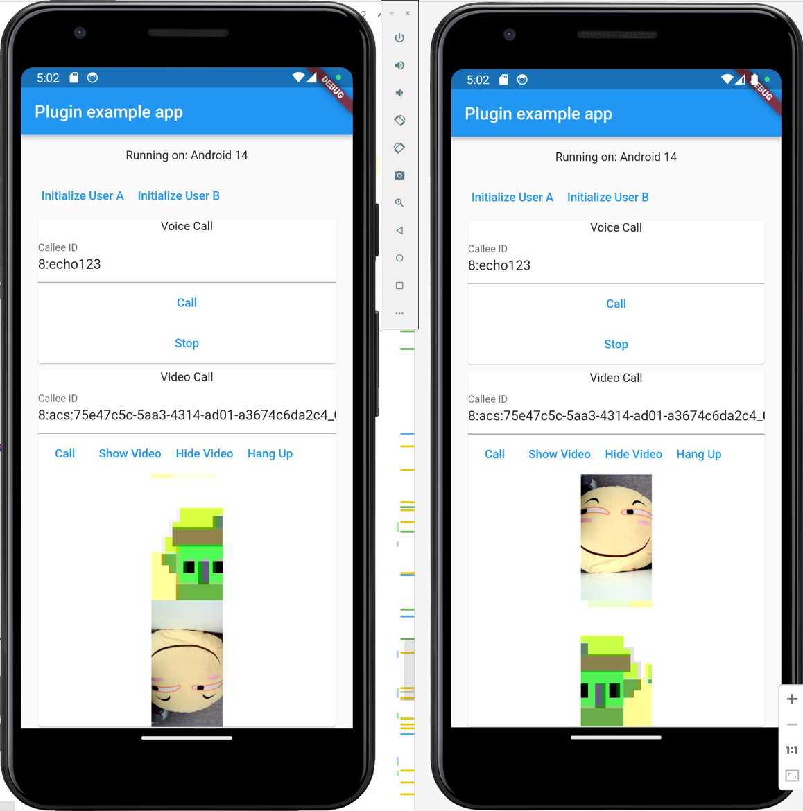

# Azure Communication Services Flutter SDK

[](https://opensource.org/licenses/MIT)
[]()

Flutter plugin for [Azure Communication Services](https://learn.microsoft.com/en-us/azure/communication-services/overview#platforms-and-sdk-libraries), which enables you to build real-time video/audio call applications(WebRTC).

This plugin is a community-maintained project, and not maintained by Azure ACS team. If you have any issues, please file an issue instead of contacting support.

This package is currently work-in-progress and should not be used for production apps. We can't garantee that the current API implementation will stay the same between versions until we have reached v1.0.0.

## Example

Check out our comprehensive [example](./example) provided with this plugin.


## Supported Platforms

- Android
- iOS (coming soon)

## Getting Started

**Install Package**

```
flutter pub add azure_communication_services_rtc
```

#### Permissions

Open the `AndroidManifest.xml` file in your `android/app/src/main` directory and add the following device permissions:

```AndroidManifest.xml
<manifest 
    xmlns:tools="http://schemas.android.com/tools"   <!-- Important(1) -->
    ...>

    <uses-permission android:name="android.permission.INTERNET" />
    <uses-permission android:name="android.permission.ACCESS_NETWORK_STATE" />
    <uses-permission android:name="android.permission.ACCESS_WIFI_STATE" />
    <uses-permission android:name="android.permission.RECORD_AUDIO" />
    <uses-permission android:name="android.permission.CAMERA" />
    <uses-permission android:name="android.permission.WRITE_EXTERNAL_STORAGE" />
    <uses-permission android:name="android.permission.READ_PHONE_STATE" />

    <application
        tools:replace="android:label"    <!-- Important(2) -->
        ...
    >
        <uses-library android:name="org.apache.http.legacy" android:required="false"/>  <!-- Important(3) -->
    </application>
</manifest>
```

### Usage

**Audio Call**

```dart
// 1. Create instance
final acsFlutter = Acsflutter();

// 2. Request permissions
await acsFlutter.getAllPermissions();

// 3. Initialize 
await acsFlutter.initialize(/**UserToken**/);

// 4. Start Call
await acsFlutter.startCall(/**CalleeUserID**/);

// 5. Stop Call
await acsFlutter.stopCall();
```

**Video Call**

```dart
// 1. Create instance
final acsFlutter = Acsflutter();

// 2. Request permissions
await acsFlutter.getAllPermissions();

// 3. Initialize 
await acsFlutter.initialize(/**UserToken**/);

// 4. Start Call
await acsFlutter.startOneToOneVideoCall(/**CalleeUserID**/);

// 5. Widget for self video view
const SizedBox(
    height: 150,
    child: LocalVideoPreviewView(viewKey: "localVideoView"),
),

// 6. Widget for remove video view
const SizedBox(
    height: 150,
    child: LocalVideoPreviewView(viewKey: "remoteVideoView"),
),
```